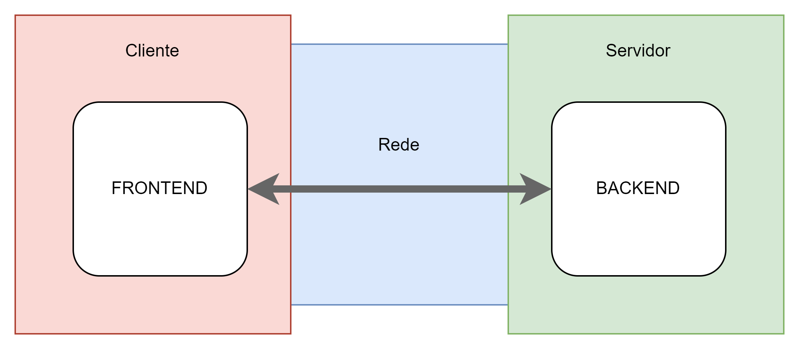
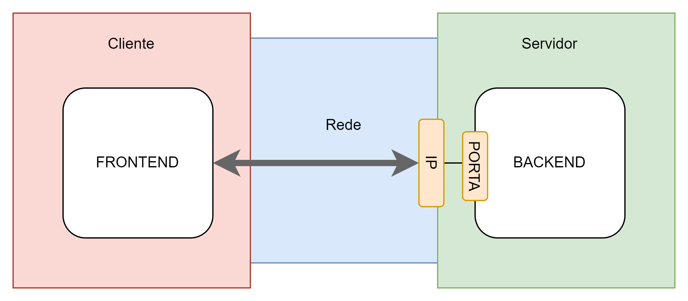
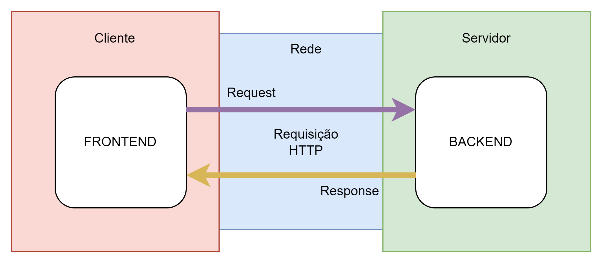
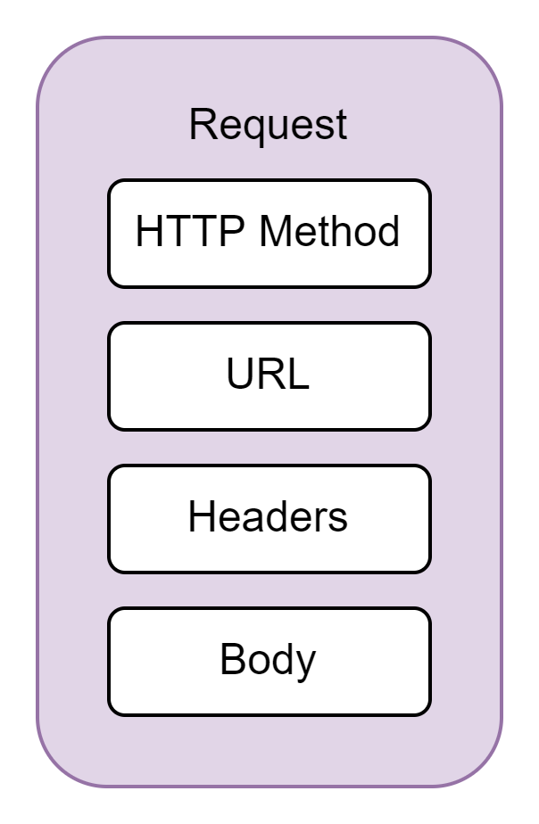
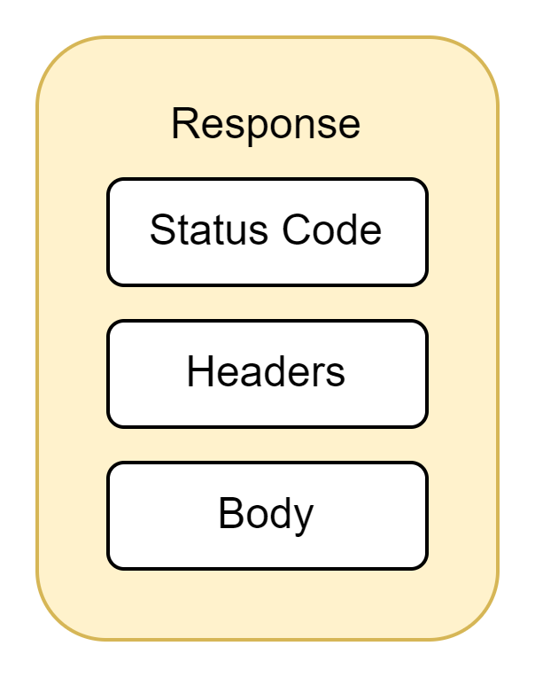
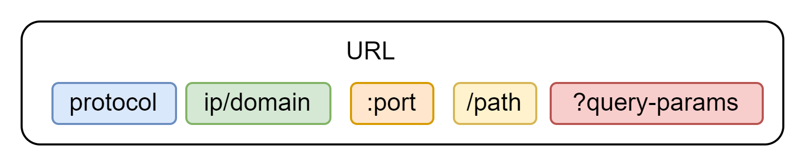
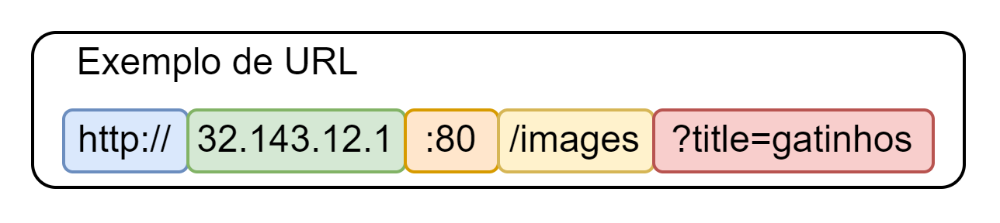

# Do Zero ao Backend

### INTRODUÇÃO

A internet é formada por computadores semelhantes aos computadores domésticos: com processador, memória ram, placa-mãe; conectados entre si através de cabos e equipamentos de rede. Desta forma, torna-se possível um computador acessar outro (parecido como acessar as fotos do celular via cabo USB). Porém, esses computadores são um pouco especiais ba sua construção: são muito potentes e compactos, não precisam de mouse, áudio ou interface gráfica. São criados exclusivamente para servir a internet.

Uma pessoa passa a fazer parte da internet quando liga o seu PC ou Smartphone, pois ele se conecta na rede, através do provedor de internet, para acessar esses outros computadores. Nesse cenário, o dispositivo utilizado pela pessoa é o que se chama Cliente e o computador que está sendo acessado de Servidor.

### FRONTEND e BACKEND (Modelo Cliente-Servidor)

Backends são softwares especificamente criados para serem executados no servidor. Nos dispositivos dos usuários como os PC, smartphones, smart tv, também são instalados softwares específicos, chamados Frontend.

O Backend é responsável por executar regras de negócios, que são procedimentos e restrições que dizem respeito a como um negócio ou parte dele funciona. Por exemplo, a regra de negócio de um desconto: compras acima de cem reais tem 20% de desconto. Já o Frontend, vai intermediar a interação do usuário com o Backend, criando-se uma camada mais amigável: com botões, animações, navegação, etc; para o usuário interagir e usufruir dos serviços disponibilizados pelo Backend através da rede.

Esse é o modelo Cliente-Servidor. Geralmente o cliente é o Frontend e o servidor é o Backend. Quando um usuário navega na internet, o Frontend ao qual ele está interagindo, faz requisições para o Backend que realiza algum processamento e devolve uma resposta, que o Frontend interpreta e apresenta para o usuário, sempre pensando na melhor usabilidade. Essa é uma das formas de como funciona a Internet.

### IP e PORTA

Na rede, cada computador conectado possui um identificador chamado IP. Quando um dispositivo precisa se comunicar com outro, ele utiliza o IP para localizar o servidor e realizar uma conexão. Também é necessário informar a Porta onde o Backend está rodando. Portas diferentes no mesmo IP significam softwares diferentes no mesmo servidor.

Dessa forma, toda requisição precisa ser direcionada para um IP e Porta específicos. O IP para identificar qual computador na rede vai receber essa requisição e a Porta para identificar qual software que será acionado para processar tal requisição.

### PROTOCOLO HTTP

Para que ocorra uma comunicação através da rede, faz-se necessária a existência de uma "gramática", chamada de protocolo. Sendo o mais utilizado para esses cenários (cliente-servidor) o protocolo HTTP. É em cima dele que a equipe de desenvolvimento de software irá definir um contato de como ocorrerá a comunicação entre o Frontend e Backend.

O protocolo HTTP define regras de comunicação para que dois dispositivos conectados na rede possam trocar dados entre si. Dessa forma, softwares instalados em dispositivos diferentes podem trabalhar em conjunto.

Também chama-se de Cliente o software que realiza uma requisição, e chama-se de Servidor o software que processa e responde à requisição.

### REQUEST e RESPONSE

Uma requisição (Request) é um pedido, uma solicitação realizada pelo software Cliente. Nela estão contidos um método HTTP, uma URL, Headers e um Request Body, que são dados extras necessários para o processamento da regra de negócio requisitada.

Ao final da Request, é produzida uma resposta (Response). Nela estão contidos um Status Code, Headers e um Response Body.

### HEADERS e BODY

Headers são metadados que descrevem e dão mais detalhes sobre a Request e Response à qual pertence, no formato chave:valor. Em contrapartida, o Body é o conjunto dos dados de entrada da Request, ou dados de saída da Response. Atualmente, o formato mais utilizado para montar um Body é o JSON, e, para isso, é necessário que o Header Content-Type tenha como valor “application/json”. Dessa forma, torna-se possível saber, através do Header, que o Body está no formato JSON.

### STATUS CODE

O Status Code classifica o resultado de uma Request. Ele pode indicar se a requisição foi bem sucedida ou se ocorreu algum erro durante o processamento, por exemplo.

Os Status Code são divididos em cinco grupos:  
**1xx:** Respostas de informação  
**2xx:** Respostas de sucesso  
**3xx:** Redirecionamentos  
**4xx:** Erros do Cliente  
**5xx:** Erros do Servidor  

### HTTP METHODS

Os métodos HTTP são utilizados para indicar qual operação será executada em determinada Request. Tal operação será um processamento aplicado aos recursos alvo dessa solicitação.

Existe um número limitado de métodos HTTP. Os mais utilizados são:  

**GET**: ao utilizar o método GET, a Request em questão indica a execução de uma consulta por algum(s) recurso(s).  

**POST**: indica a solicitação de criação de recurso.  

**DELETE**: indica a exclusão de recurso(s).  

**PUT**: indica uma operação de upsert. Se o recurso em questão já existir, então ocorre uma atualização completa ou reescrita. Caso contrato, o recurso será criado.  

**PATCH**: indica atualização parcial de algum recurso.

### URL

A URL é um identificador, e localizador, de recursos na internet. Ela funciona como um endereço de uma casa, contendo também qual pessoa com quem se quer falar e qual o idioma dela. Porém, para a URL se tem o protocolo, o ip, a porta e o path. Opcionalmente, é possível enviar dados na URL através dos query-params no formato chave=valor. Como foi visto, o protocolo (idioma) define as regras para uma comunicação entre dois dispositivos na rede, o ip (CEP) identifica qual servidor na rede com quem se quer comunicar, a porta (número da casa) identifica qual software tem o controle do recurso alvo e o path (pessoa) identifica qual é o recurso.

### RESOURCE

Um recurso é uma abstração que representa algo individual mantido pelo sistema, como: um documento, uma foto, dados de uma pessoa, um registro de pagamento, uma publicação, um comentário, etc. Os recursos são gerenciados pelo Backend. Isto significa que navegar na internet é operar recursos, é executar processamentos em recursos. Por exemplo: postar uma foto, atualizar os dados do perfil, fazer uma busca por palavras-chave, comentar uma publicação, etc.

### PATH

Cada Path representa um caminho para uma ou mais instâncias de um recurso. Por exemplo: se Produto é um recurso do sistema, pode existir um path que representa um conjunto de Produtos e outro Path que representa um Produto específico.

A combinação de um Método HTTP e um Path é única dentro de um Backend, pois essa combinação representa (com um certo grau de abstração) a operação que pode ser executada para um determinado recurso (ou um conjunto de recursos). Por exemplo: para realizar a exclusão de uma foto, pode-se utilizar o método DELETE junto com o path que representa a foto que se quer excluir.

Por padrão, utiliza-se a porta 80 para comunicação via HTTP, e a 443, para a comunicação HTTPS. Sendo o HTTPS a versão segura do HTTP. Dessa forma, não informar a porta na URL significa que estamos querendo acessar uma porta padrão.

#### CONCLUSÃO

O Backend é um software que é instalado em servidores e seu uso é feito através da rede. Ele pode se comunicar com um Frontend ou com outros Backends. Ao adotar o modelo Cliente-Servidor, um cenário típico é o Frontend assumir o papel de Cliente e o Backend assumir de Servidor. Isso significa que o Frontend será ativo na comunicação, e toda interação entre os sistemas começarão pelo Frontend através de uma Request. E o Backend vai responder a essa Requisição enviando de volta uma Response, gerada a partir do processamento dessa Requisição. Essa é a dinâmica básica de comunicação do protocolo HTTP. Uma das formas de como a internet funciona.

 
